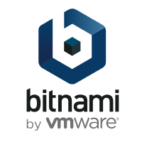

# How to install MongoDb as Docker image

<p>
  <a href="./LICENSE">
      
  </a>
  
</p>

<p align="center">


</p>


# In Minikube Kubernetes

<p align="center">


</p>

# Using bitnami/postgresql helm chart

<p align="center">


</p>

https://github.com/bitnami/charts/tree/main/bitnami/mongodb

With the default binami installation, when **Minikube** restart ( i.e. when laptop or server restart), the **StatefulSet** postgresql failed to start with a message "Back-off restarting failed container", because its **Container** cannot read/write with the default **StorageClass** in the previously used **PersistentVolume**.

# Customised install

We use a **StorageClass** with **reclaimPolicy: Retain**, to keep data when the server/laptop where Minikube is running, restart.
As Bitnami chart container run as user 1001 in goup 1001 we have to change default file acces mode of the **PersistentVolume** hostPath.

# Customise install according to projet and Minikube server ip.
Create your own folder, in networking/values, named with the server ip, like 192.168.0.24. 

Copy there the two files and update values for your needs:
- mongodb.yaml where you can modify database name, user and password, persistence size.
- pv-mongodb.yaml where you can describe persistant volume specification like hostPath and capacity storage ( same as persistence size below).

Please note: pv-name and pv-hostPath are also present in install.sh for their creation and access rights.

# How to install

```bash
#Add bitnami repo only once
sudo helm repo add bitnami https://charts.bitnami.com/bitnami
```

 ## Minikube
 For install run:
```bash
cd networking/mongodb-minikube
./install.sh [projectName] [server-ip]
# where 
#  - projectName: is the name of the project for witch Mongodb is installed
#  - server-ip: is the ip, like 192.168.0.24, who's used by Kubernetes Mongodb service to share the database with external uses.
#      127.0.0.1 is not a valid server-ip, it will be confused with Mongodb Docker loopback localhost ip adress.
```
Warning, if Minikube was started as super user, you have to use sudo.
Sample:
```bash
cd networking/mongodb-minikube
sudo ./install.sh cirrus-project 192.168.0.24
```

Backup database:
```bash
cd networking/mongodb-minikube
./backup.sh [projectName] 

```
Archive file is copied to '/archive/'

Restore database:
```bash
cd networking/mongodb-minikube
./restore.sh [projectName] 

```
Last archive files in '/archive/' is restored.


Uninstall:
```bash
helm -n [projectName]-mongodb uninstall mongodb
# where 
#  - projectName: is the name of the project for witch PostgreSql is installed
```

Sample:
```bash
sudo helm -n cirrus-project-mongodb uninstall mongodb

```

## Microk8s:
For install run:
```bash
cd networking/postgresql-microk8s
sudo ./install.sh [projectName] [server-ip]
```
Backup database:
```bash
cd networking/mongodb-microk8s
sudo ./backup.sh [projectName] 

```
Restore database:
```bash
cd networking/mongodb-microk8s
sudo ./restore.sh [projectName] 

```
Uninstall:
```bash
sudo microk8s helm -n [projectName]-postgresql uninstall postgresql
```